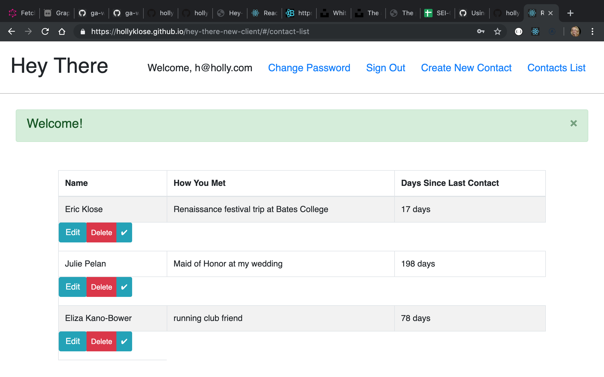

# Hey There: Contact Management

### Application Description
This is the front end of the Hey There application which is designed to allow the user to manage their contacts, and specifically to use the app's proprietary sorted list to easily see at a glance which contacts are highest priority and/or most overdue to be contacted. This could be useful for business networking, keeping track of sales leads, or managing contacts in a job search. The hiring manager at your job of choice should probably be contacted with higher priority than a casual contact!

In this app, contacts belong to the user and can be added, deleted, edited, viewed,
and have their last contacted date updated.

### List of Technologies Used
-graphql
-Ruby on Rails
-graphiql

### Database and Routes
The database is comprised of two tables: User, and Contacts which belong to the User.
The authorization has separate routes, but all the contacts POST, PATCH, GET and
DELETE use the same Graphql controller and endpoint.

### Set up and installation instructions for front end application
npm install
npm install moment
npm install add apollo-client apollo-cache-inmemory apollo-link-http apollo-link-error apollo-link graphql graphql-tag react-apollo

### Authentication

  | Verb   | URI Pattern            | Controller#Action |
  |--------|------------------------|-------------------|
  | POST   | `/sign-up`             | `users#signup`    |
  | POST   | `/sign-in`             | `users#signin`    |
  | PATCH  | `/change-password/`    | `users#changepw`  |
  | DELETE | `/sign-out/`           | `users#signout`   |

### Contacts

  | Verb   | URI Pattern            | Query/Mutation    |
  |--------|------------------------|-------------------|
  | GET    | `/graphql`             | `contacts_query`  |
  | GET    | `/graphql`             | `contact_query`   |
  | POST   | `/graphql`             | `create_contact`  |
  | DELETE | `/graphql`             | `delete_contact`  |
  | PATCH  | `/graphql`             | `update_contact`  |
  | PATCH  |  `/graphql`            | `update_last_contacted` |

  [Front and Back End deployed sites]

  [Back end] (https://murmuring-dawn-91418.herokuapp.com/)

  [Front end] (https://hollyklose.github.io/hey-there-new-client/)

  [Front End Repository] (https://hollyklose.github.io/hey-there-new-client/)

  [Back End Repository] (https://github.com/hollyklose/Hey-There-Rails-API)

  ### Wireframe

  (https://imgur.com/PJz9Ko4)

  ### Entity Relationship Diagram:

[Actual] (https://imgur.com/kXsgT68)
[Stretch] (https://imgur.com/BpucYV1)

### User stories

1. I want to make sure I contact the most high priority contacts in my job search
as promptly as possible.
2. When I have 5 minutes to reach out to someone, I want to be able to tell at a glance
who I might want to reach out to next.
3. I don't want useless reminders nagging me about contacting people. I want to seek out
that information.
4. The amount of time that has passed since I last talked to someone definitely matters,
but also the priority of any given contact at the moment (ie. the hiring manager of a
company I'm specifically interested in).
5. I want to be able to change the priority or frequency of desired reaching out of
any given contact because that can change over time.
6. I want to be able to quickly cross a contact off my list (or move them down the list
in the priority stack) once I've contacted them.

### Screenshot of application

### Planning, Process and Problem-solving strategy

After reading a ton about Graphql, I started out by following two different tutorials each (so two for front end and two for back end) for both the back end (with Rails) and front end (with React and Apollo). React and Apollo was suggested as good "beginner" tech for Graphql novices, and I wanted to practice with React anyway.

After setting up the basic Rails backend and the first Graphql Query (which is basically "index"), I was mostly on my own. I'm glad I started over the weekend as it took me several hours just to set up the Graphiql backend playground which was essential to figuring out how to write my Graphql queries and mutations (edit, delete, create) appropriately.

I also spent a long time on the weekend trying to tie the Rails' (and then React's) built in authentication to work with graphql. One difficulty (but hopefully also a benefit in the future) is that graphql has one Controller and one endpoint (other than the existing auth endpoints which I still used). This was a new way of doing things for me.

The other major problem I had to solve on the backend was actually writing the "resolver" functions to return the right data from the backend to the frontend. For a while I was successfully deleting or editing contacts from the front end, but would still receive a server error in the console. I eventually solved this by actually returning something on the backend in those resolver functions. Nothing returns unless you ask it to!

While I started with the backend, it was really necessary to work on the back and front ends simulataneously as I learned how Graphql interacts from both sides. With each new method (create, index, delete, edit) I had to make adjustments on both sides.

On the front end, a lot of the difficulty revolved around making graphql queries or mutations which, at least in the tutorials I was using, happen in the return part of the component. This made it difficult to update the state without causing render issues. The way I solved this with the edit contact function was to create an edit contact component which fetched the contact's existing data and then passed it to a separate component which prepopulated the form and then made the mutation (edit) request. In the future, I would follow this pattern for all components with graphql, separating queries or mutations from their display components.

Another major issue I ran into late in the game was that I was not handling all the server (specifically validation) errors appropriately. I could see that graphql was returning error messages, but I couldn't figure out how to access them. Honestly, I still am unsure how to access the actual server messages, but I did manage to change my mutations/queries on the front end to use a .then and .catch format in the appropriate place (which was a challenge in itself!) and provide feedback to the user when there is an error.

And yet another issue was that I somehow broke the built in signup function! The reason turned out to be the way I was passing the authorization header to the Apollo client. I added a couple of lines from Signin to Signup to set the authorization header earlier in the process and that fixed the issue. This may sound like a quick fix, but it wasn't that quick!

One fun thing was creating the sorting algorithm for the contact list sort. While I had
to try several versions to get it to work properly, it was fun to have a plain old
javascript challenge! I definitely want to make the algorithm more subtle in the future.

I would have liked to do more with the formatting, but I feel pretty good about how much I learned implementing graphql, and also implementing React (and Apollo for that matter). I think both technologies will be awesome in the future!

### Unsolved Problems and Future Improvements

As you can see in the "stretch" ERD diagram, my original hope was to have an additional table of tags, including things like location, school, employer, hobby, etc, which would be added to contacts to help you understand how your contacts are all connected. I wanted to have a lot of search functionality to, for instance, let you search for people you know in a city you plan to travel to. Ideally I would also implement some kind of visual representation of the contacts to help you understand how people might be connected. I expect and hope that graphql will be an awesome tool for this moving forward.

I started out trying to use the Apollo cache instead of using state everywhere in React. but abandoned it for this project as I had trouble getting this to update and reset appropriately. I look forward to figuring this out once I have more time.

I definitely want to start by improving the existing UI to make it more user friendly and
certainly more visually interesting.
